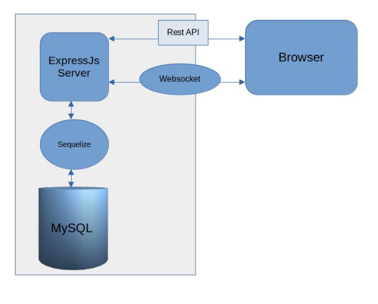

# Top score board backend api example
## Requirements
1. We have a website with a score board, which shows the top 10 user’s scores.
2. We want live update of the score board.
3. User can do an action (which we do not need to care what the action is), completing this action will increase the user’s score.
4. Upon completion the action will dispatch an API call to the application server to update the score.
5. We want to prevent malicious users from increasing scores without authorisation.

Backend service use ExpressJs + SQL 

.

## Setup dev environment
Install nodejs\
https://nodejs.org/en/download

Init project\
https://dev.to/cristain/how-to-set-up-typescript-with-nodejs-and-express-2023-gf

## Rest API
- Server port 8000
- Base address https://<HOST_NAME>:8000
- Routes
    - POST /players/register register new player
    - POST /login player login service
    - GET /scores - response top 10 score
    - GET /scores/:id - get user score by id
    - POST /action - finish task process new score for user save action time for block if user spam must more request. Example maximum 2s/1req
- Websocket
    - /scores handle update scores
